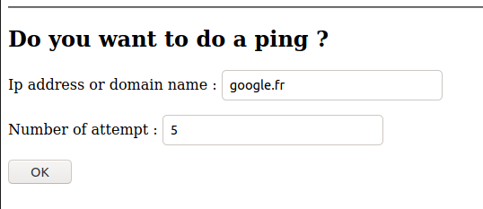
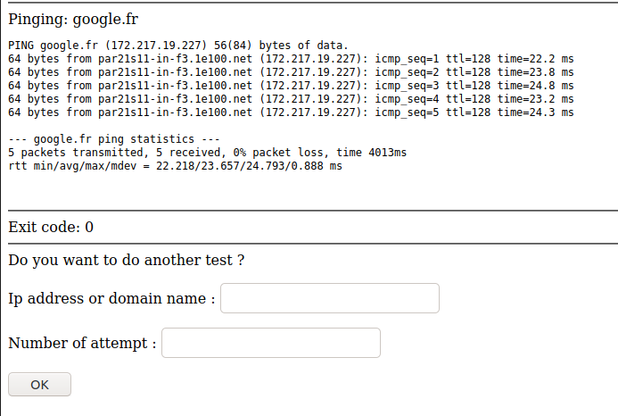
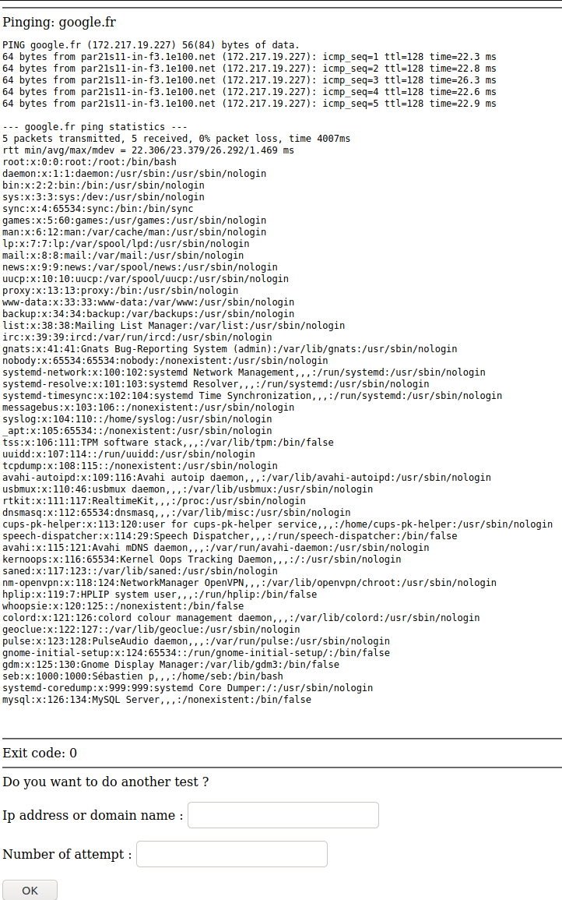
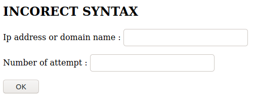

# PROJET SECWEB


## Introduction

Nous allons expérimenter une faille d'injection de shellcode sur un serveur web.
La configuration est la suivante :
* Le système d'exploitation est Ubuntu20.04
* Le serveur web est apache2
* Le moteur php est PHP 7.4.3

## Présentation de la faille

### La page web :

Prenons une page web développée en PHP permettant de réaliser un ping sur n'importe quel serveur sur internet :

```php
<?php
    error_reporting(E_ALL);
    ini_set('display_errors','On');
    if (!isset($_POST['submit'])) $_POST['submit'] = "NOK";
    if ($_POST['submit'] == "OK"){
        echo '<hr />Pinging: '. $_POST['ip'] . '
         <pre>';
        $command = 'ping ' . $_POST['ip'] . ' -c ' . $_POST['attempt'];
        $last_line = system($command, $retval);
        echo '
        </pre>
        <hr />Exit code: ' . $retval .'
        <hr /> Do you want to do another test ?';
    }
    else
            echo '<hr /> <h2>Do you want to do a ping ?</h2>';
?>

<form action="index.php" method="post">
 <p>Ip address or domain name : <input type="text" name="ip" /></p>
 <p>Number of attempt : <input type="text" name="attempt" /></p>
 <p><input type="submit" name="submit" value="OK"></p>
</form>
```





### La faille :

Le problème est qu'avec une petite connaissance de PHP et du shell unix, on se rend compte rapidement que l'on peut exécuter d'autres commandes en rajoutant un `;` à la fin du dernier champ :




## Correction de la faille

### Proposition de correction :

Pour corriger cette faille il faut vérifier que les champs `ip` et `attempt` ne contiennent pas le séparateur de commandes unix `;`.
Or le `;` n'est pas le seul caractère posant problème. Pour éviter d'en oublier un, il faudrait mieux vérifier que les caractères saisis correspondent à ce que l'on attend.
Appliquons donc les regex suivantes :
* Pour le champ `ip` : `^(\w*\.)+(\w+\z)`
* Pour le champ `attempt` : `/^\d+\z/`

### Correctif :

Le code suivent applique la correction proposée :

```php
<?php
    error_reporting(E_ALL);
    ini_set('display_errors','On');
    $url_or_ip_regex = '/^(\w*\.)+(\w+\z)/';
    $number_regex = '/^\d+\z/';

    if (!isset($_POST['submit'])) $_POST['submit'] = "NOK";
    if ($_POST['submit'] == "OK"){
        if (( preg_match($url_or_ip_regex, $_POST['ip']) == 1 )       
            and ( preg_match($number_regex, $_POST['attempt'] ) == 1 )) {

            echo '<hr />Pinging: '. $_POST['ip'] . '
            <pre>';
            $command = 'ping ' . $_POST['ip'] . ' -c ' . $_POST['attempt'];
            $last_line = system($command, $retval);
            echo '
            </pre>
            <hr />Exit code: ' . $retval .'
            <hr /> Do you want to do another test ?';
        } else {
            echo '<h2>INCORECT SYNTAX</h2>';
        }
    }
    else
            echo '<hr /> <h2>Do you want to do a ping ?</h2>';
?>

<form action="index.php" method="post">
 <p>Ip address or domain name : <input type="text" name="ip" /></p>
 <p>Number of attempt : <input type="text" name="attempt" /></p>
 <p><input type="submit" name="submit" value="OK"></p>
</form>

```

### Vérification :

Re-essayons d'exploiter la faille :




## Conclusion

L'injection est une faille qui peut être très impactante sur les systèmes d'informations, mais en prenant les bonnes dispositions, elle peut être facilement corrigée.
Dans notre exemple, la faille permettait d'exécuter n'importe quelle commande unix depuis la page web mais une simple regex élimine totalement la faille.

***Sébastien PEZAC***
